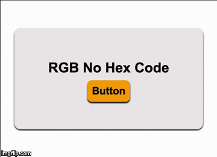
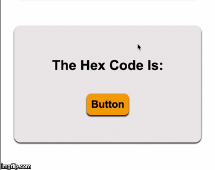
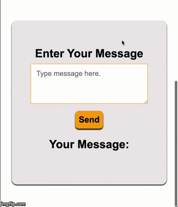
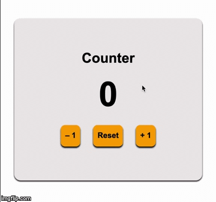
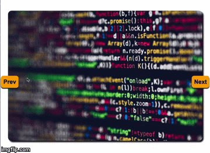
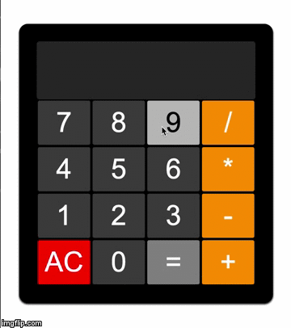
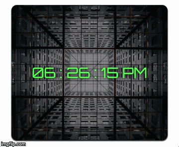

# Vanilla-JavaScript-Projects-V-1
Projects using Vanilla JavaScript with custom designs.
Order of projects:

-Change Background Color

-Change Background w/ Hex Color

-Input Message

-Counter

-Quote Generator

-Image Slider

-Calculator

-Clock

 Reference video walkthrough by ' Coding Addict ' https://www.youtube.com/watch?v=Kp3HGwlXwCk&amp;feature=youtu.be 
 * only use this repo for practice of Vanilla JavaScript
